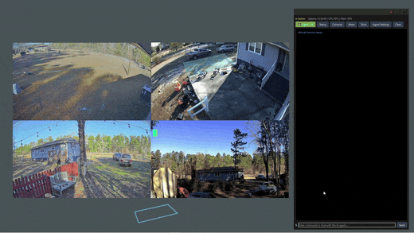
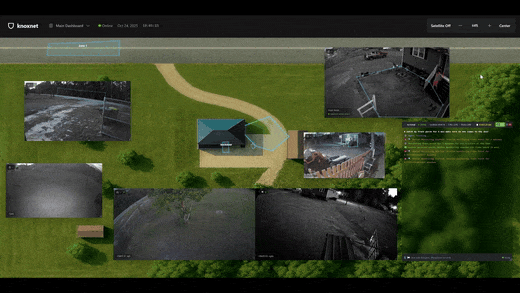
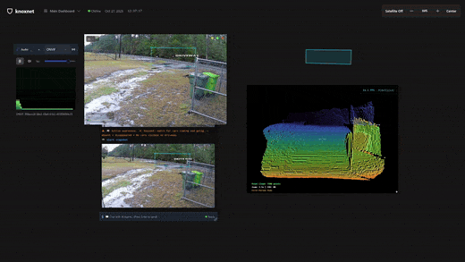
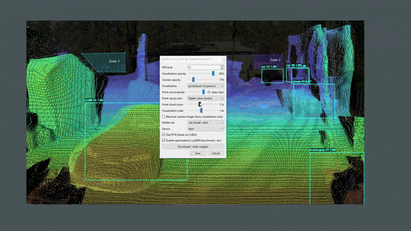
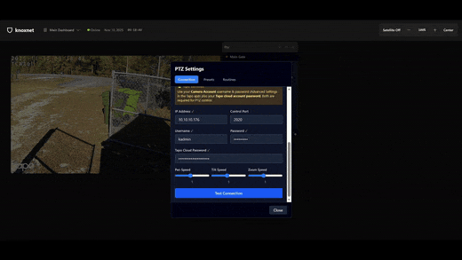
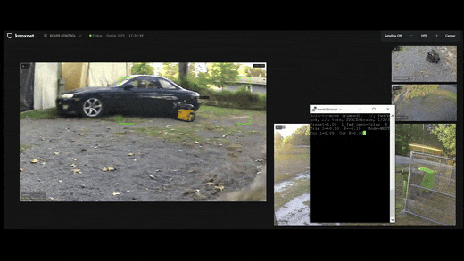
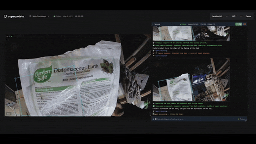
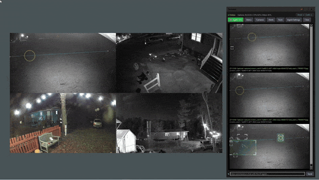

# Knoxnet VMS Beta

Knoxnet VMS Beta is a local-first video management system for IP cameras. It is designed for users who want to view, organize, and test camera workflows on their own hardware without relying on expensive cloud camera subscriptions.

**Knoxnet VMS Beta is early technical beta software. Do not rely on it yet for production-critical security, life-safety, or mission-critical monitoring.**

Current beta: v1.0.0-beta1

## Demo GIFs

<table>
  <tr>
    <td width="50%">
      
      <br />
      <strong>Multi-camera desktop VMS</strong>
      <br />
      Monitor live camera grids with desktop controls, event panels, and responsive layouts.
    </td>
    <td width="50%">
      
      <br />
      <strong>Live overlays and site context</strong>
      <br />
      Review overlay experiments and site/context views where configured.
    </td>
  </tr>
  <tr>
    <td width="50%">
      
      <br />
      <strong>Depth-aware analysis</strong>
      <br />
      Run depth estimation alongside regular camera views.
    </td>
    <td width="50%">
      
      <br />
      <strong>Depth, objects, and motion</strong>
      <br />
      Combine depth maps, object boxes, and motion overlays for richer scene understanding.
    </td>
  </tr>
  <tr>
    <td width="50%">
      
      <br />
      <strong>PTZ and camera controls</strong>
      <br />
      Use PTZ and audio controls where camera support and local configuration allow.
    </td>
    <td width="50%">
      
      <br />
      <strong>Object and vehicle detection</strong>
      <br />
      Test object and vehicle detection workflows on supported camera feeds.
    </td>
  </tr>
  <tr>
    <td width="50%">
      
      <br />
      <strong>Optional local vision workflows</strong>
      <br />
      Experiment with local vision tooling for frame inspection and summaries.
    </td>
    <td width="50%">
      
      <br />
      <strong>Night and low-light monitoring</strong>
      <br />
      Review low-light scenes and multi-camera night views from the same monitoring surface.
    </td>
  </tr>
</table>

## What It Does

- Add and view IP camera streams.
- Configure RTSP/IP cameras manually or use discovery where supported.
- Organize camera layouts and camera profiles.
- Test local-first VMS workflows on user-owned hardware.
- Experiment with object detection and analytics features where supported by your hardware and model setup.
- Keep camera workflows local when possible.
- Serve as the public beta and community testing version of Knoxnet VMS.

## Who It's For

- Home users with a few IP cameras.
- Homelab and self-hosted users.
- Low-voltage and security installers evaluating local camera workflows.
- Small business testers who understand this is not production-ready yet.
- Developers interested in local-first video tools.
- People who want an alternative to cloud-only camera platforms.

## Free 4-Camera Beta

Knoxnet VMS Beta is free for up to 4 cameras.

The 4-camera limit is intentional. Local video decoding, recording, and analytics can become resource-intensive quickly. Four cameras is enough for many residential, hobby, and test systems while helping prevent users from accidentally overloading a normal desktop or laptop.

Higher camera counts are intended for dedicated hardware and future official Knoxnet VMS releases.

## Official Builds and Support

Official Knoxnet VMS Beta releases support up to 4 cameras.

Modified forks, altered camera limits, unofficial builds, and redistributed versions are not supported by Knoxnet Security.

If you modify the software, remove limits, redistribute a changed build, or run an unofficial version, you are responsible for testing, maintaining, securing, and supporting that version.

Support, bug reports, and feedback should be based on official releases from this repository unless clearly stated otherwise.

## Hardware / Performance Notes

Video workloads are heavy. Performance depends on camera count, resolution, frame rate, codec, recording settings, analytics settings, CPU/GPU, RAM, disk speed, and network quality.

A normal desktop may handle a few cameras, but it should not be expected to run large camera systems while also being used as a daily PC. A 4-camera test system is a reasonable starting point for most users. Running 16, 32, or more cameras should be treated as a dedicated-server workload, not a casual desktop app workload.

## Quick Start

Python 3.10 or newer is recommended. The installer creates a local `.venv`, installs Python dependencies from `requirements.txt`, and copies `env.example` to `.env` if needed. MediaMTX is downloaded automatically on first server start if the binary is missing.

Clone the repo:

```bash
git clone https://github.com/PhillipAlexanderYoung/Knoxnet-vms-beta
cd Knoxnet-vms-beta
```

Linux:

```bash
./install.sh
./run.sh
```

Windows batch wrappers:

```powershell
install.bat
run.bat
```

Windows PowerShell:

```powershell
.\install.ps1
.\run.ps1
```

If PowerShell blocks scripts, run the `.bat` wrappers or start PowerShell with execution policy bypass for this session.

## Add Cameras

1. Start the desktop app.
2. Use the first-run setup wizard or tray menu camera configuration.
3. Add RTSP/IP cameras manually or use discovery where supported.
4. Keep the public beta limit of 4 configured cameras in mind.

Camera credentials stay local. Do not commit `.env`, `data/`, `cameras.json`, recordings, captures, logs, RTSP URLs with credentials, or private site configs.

## Updating the Beta

On startup, Knoxnet VMS Beta checks the public Knoxnet update endpoint for the latest beta version. If a newer beta is available, the app shows a non-blocking message:

```text
Update available: version X. Download the latest beta from GitHub.
```

The beta does not auto-update. Polished installers and automatic updates are planned later, but this public beta is designed for fast iteration and easy testing.

To update during the beta:

1. Stop Knoxnet VMS.
2. Back up any local config you care about.
3. Delete the local beta folder.
4. Clone the latest version from GitHub again.
5. Run the install/start commands again.

Linux:

```bash
git clone https://github.com/PhillipAlexanderYoung/Knoxnet-vms-beta
cd Knoxnet-vms-beta
./install.sh
./run.sh
```

Windows:

```powershell
git clone https://github.com/PhillipAlexanderYoung/Knoxnet-vms-beta
cd Knoxnet-vms-beta
install.bat
run.bat
```

## Privacy / Local-First Direction

Knoxnet VMS is being designed around local-first camera workflows. Avoid exposing camera systems directly to the public internet. Remote access should be handled carefully with VPN, Tailscale, WireGuard, or secure tunnel approaches.

Do not commit or share camera passwords, RTSP URLs with credentials, private site configs, customer data, Cloudflare secrets, API keys, or deployment-specific configs.

## Relationship to Knoxnet System Designer

Knoxnet System Designer is a separate free PDF markup and system layout tool. In the future, Knoxnet VMS may be able to import system designs so camera locations, IP schemes, and floor plans can become live interactive camera maps.

Knoxnet System Designer: https://github.com/PhillipAlexanderYoung/knoxnet-system-designer

## Roadmap

- Easier installer.
- Official signed builds.
- Better update flow.
- More camera support in future official paid tiers.
- Improved recording and retention tools.
- Better object detection and analytics.
- Alerts and reports.
- Multi-layout dashboards.
- Optional Knoxnet System Designer integration.
- Live camera maps on floor plans and site drawings.
- Better documentation and setup guides.

## Known Issues

- This is early beta software and may have rough edges in setup, camera discovery, and GPU acceleration.
- The beta is limited to 4 cameras. There is no paid upgrade path in this repo yet.
- Updates are manual. The app only notifies when a newer beta is available.
- No installer, code signing, PyInstaller bundle, or auto-updater is included.
- Camera compatibility may vary.
- Some RTSP/ONVIF streams may require manual configuration or vendor-specific credential settings.
- CPU-only systems may run object detection slowly.
- Optional AI features may require additional model downloads and disk space.
- Performance varies widely by hardware.
- Recording and retention behavior may still be changing.
- UI and install flow may change quickly.
- Do not use this beta for production-critical security workflows.

## Feedback / Bug Reports

Please report bugs through GitHub Issues: https://github.com/PhillipAlexanderYoung/Knoxnet-vms-beta/issues

Include:

- OS and version.
- Hardware specs.
- Python version.
- Install/start command used.
- Camera count.
- Camera model if known.
- Stream type and codec if known.
- Steps to reproduce.
- What happened and what you expected.
- Screenshots or logs if available, with credentials removed.

## License

Knoxnet VMS Beta Public Beta License Notice

Copyright (c) 2026 Knoxnet. All rights reserved.

This repository is published as a public technical beta for testing, evaluation, demo creation, and feedback. You may clone and run the beta for personal or internal evaluation with up to four cameras.

You may not sell, sublicense, redistribute, repackage, host as a service, remove Knoxnet branding, or use this beta in production-critical security environments without written permission from Knoxnet.

This beta is provided as-is, without warranty of any kind.

## Public Repo Safety

This public beta intentionally excludes private Cloudflare Worker code, internal deployment tooling, paid entitlement/payment logic, customer deployment scripts, signing assets, installers, and generated local data. See `PUBLIC_RELEASE_CHECKLIST.md` before publishing a new beta snapshot.
